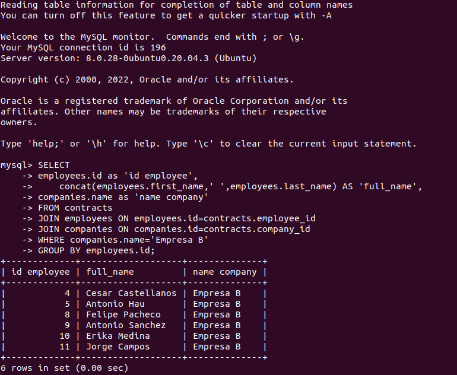
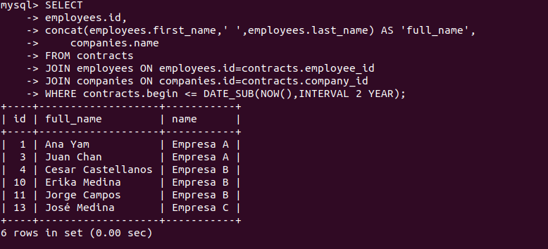
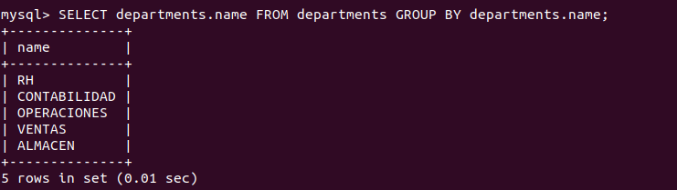
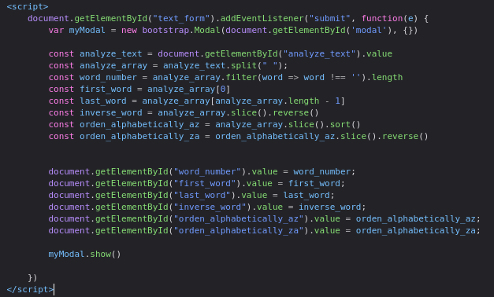
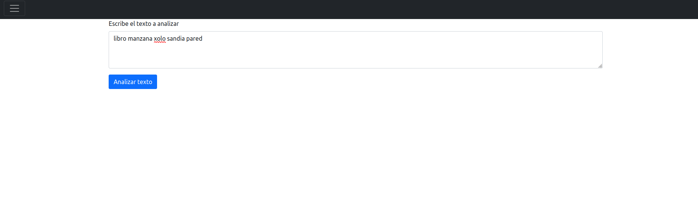
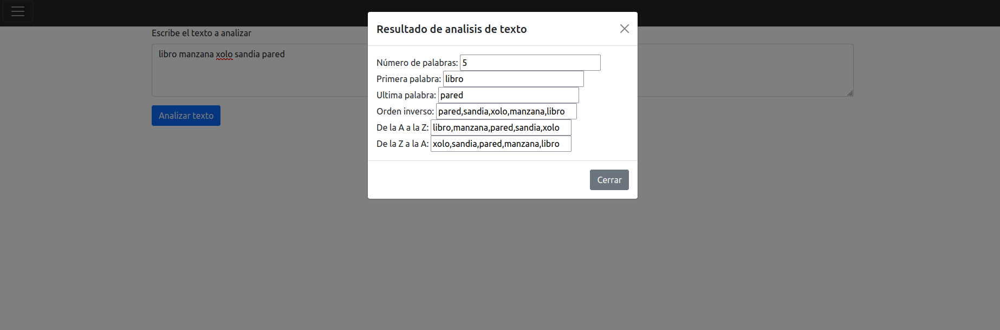
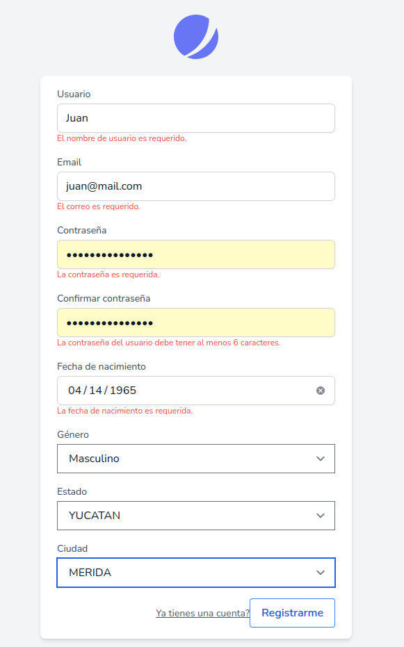
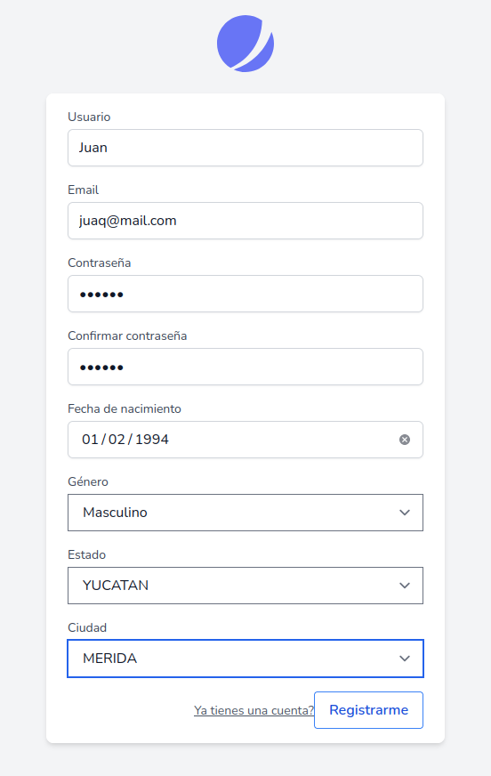

# About test
1.1. Empleados de la empresa B.
 ---
<code>
SELECT 
	employees.id as 'id employee',
    concat(employees.first_name,' ',employees.last_name) AS 'full_name',
	companies.name as 'name company'
FROM contracts
JOIN employees ON employees.id=contracts.employee_id
JOIN companies ON companies.id=contracts.company_id
WHERE companies.name='Empresa B'
GROUP BY employees.id;
</code>

1.2. Empleados que tengan antigüedad mayor o igual a 2 años y a que empresa pertenecen.

<code>
SELECT 
	employees.id,
	concat(employees.first_name,' ',employees.last_name) AS 'full_name',
    companies.name
FROM contracts 
JOIN employees ON employees.id=contracts.employee_id
JOIN companies ON companies.id=contracts.company_id
WHERE contracts.begin <= DATE_SUB(NOW(),INTERVAL 2 YEAR);
</code>

1.3. Departamentos de todas las empresas pero que no se repitan.
 ---
<code>
SELECT departments.name FROM departments GROUP BY departments.name;
</code>

2.1. Leer una cadena de texto en un formulario y generar un array con la función split(). Posteriormente, mostrar la siguiente información: Número de palabras, primera palabra, última palabra, las palabras colocadas en orden inverso, las palabras ordenadas de la a la z y las palabras ordenadas de la z a la a. Sacar toda esta información en una ventana nueva.
---
 
 
 

3.1. Formulario de registro 
---
 
 
## License

The Laravel framework is open-sourced software licensed under the [MIT license](https://opensource.org/licenses/MIT).
